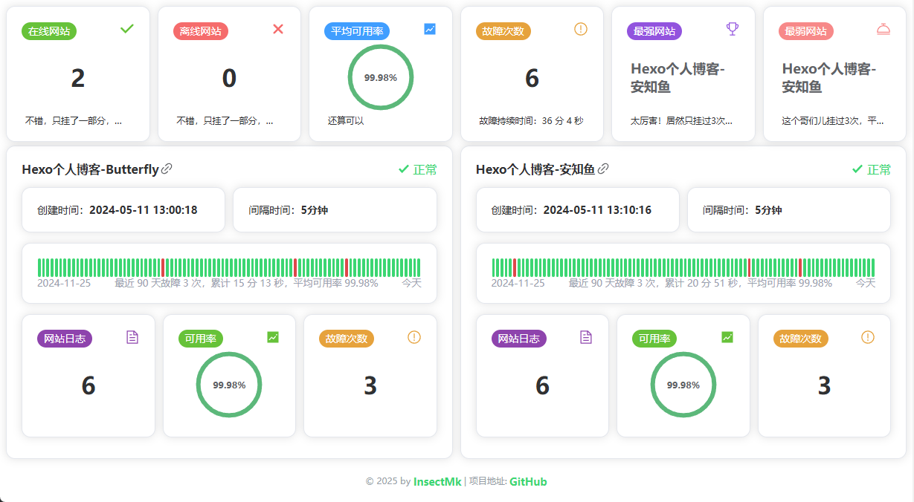

# website-status

网站状态监控，基于[UptimeRobot接口](https://uptimerobot.com/api/)制作。
本项目为纯前端项目，使用`vite`+`typescript`+`vue3`+`Element-Plus`。

## 介绍

### 关于项目目录

```tex
my-vite-project/
├── public/
├── src/
│   ├── api/                 # API 请求封装
│   ├── assets/				 # 静态资源文件
│   ├── components/			 # 组件
│   ├── config/			     # 配置文件
│   ├── constants/           # 常量配置
│   ├── router/			     # 路由（可不用的，先加上了）
│   ├── store/			     # 全局消息管理（暂未使用）
│   ├── types/               # TypeScript 类型定义
│   ├── utils/				 # 工具
│   ├── views/               # 页面组件（与 pages/ 类似）
│   ├── App.vue
│   └── main.ts
├── .prettierrc.js			 # prettier代码美化
├── .gitignore				 # git忽略文件
├── index.html
├── package.json
├── vite.config.ts
└── README.md
```

### 页面



## 命令

### ESLint

对语法检测、限制和修复

```bash
# 语法检测
npx eslint yourfile.js
```

### Prettier

代码格式化插件

```bash
# 格式检查
npx prettier . --check
# 格式化并写入
npx prettier . --write
```

## 参考文档

### 官方

[Vite官方中文文档](https://vitejs.cn/vite3-cn/)

[ESLint官方中文文档](https://zh-hans.eslint.org/docs/latest/use/getting-started)

[Prettier官方文档](https://prettier.io/docs/install)

[Vue Router| Vue.js 的官方路由](https://router.vuejs.org/zh/)

[Element-Plus | 基于 Vue 3，面向设计师和开发者的组件库](https://element-plus.org/zh-CN/)

[Axios 是一个基于 promise 的网络请求库，可以用于浏览器和 node.js](https://www.axios-http.cn/)

[UptimeRobot接口文档](https://uptimerobot.com/api/)

[Pinia符合直觉的 Vue.js 状态管理库](https://pinia.vuejs.org/zh/)

### 博客

[Element Plus 实现Icon图标的自动导入](https://www.cnblogs.com/fuct/p/17533365.html)
